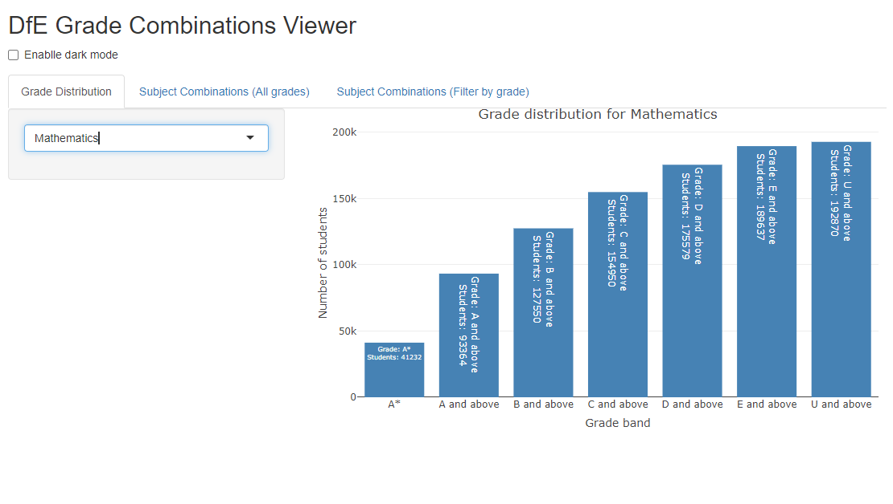
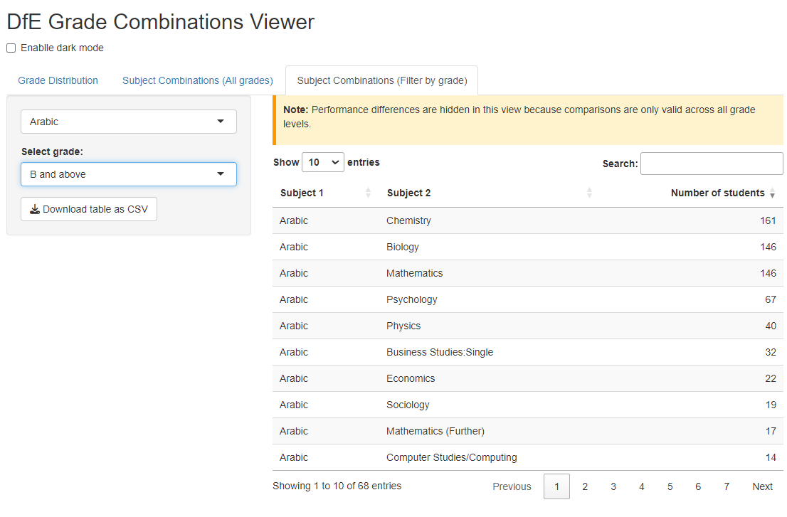

# Department for Education: A-Level Grade Combinations Analyser

   * [Background information](#background-information)
   * [Core features](#core-features)
   * [Limitations](#limitations)
   * [Running the app](#running-the-app)

---

## Background information

The **Department for Education (DfE) A-Level Grade Combinations Analyser** is an R Shiny application developed during my internship at the DfE. It visualises precomputed A-Level subject pairings and student performance (PPE scores) to support decision-making by students, parents, and University admissions boards. Presented to a group of interdepartmental policymakers and Ofqual analysts, it is now under review for further features to be added (i.e., separating by sex, postcode, etc.).

Designed for interpretability and policy relevance, the app allows users to:

- Explore how often subject combinations occur, and the relevance between getting grades in one A-Level subject to others (i.e., how getting an A in Mathematics affects students' grades in Physics)
- View grade distributions across individual subjects
- Compare normalised PPE scores between groups of students based on subject pairings, as well as percentage-wise comparisons

All data is fully **preprocessed outside the app** - no calculations or inference are performed within the application. This ensures clarity, reproducibility, and speed.

---

## Core features

- **Interactive grade distribution visualisation**  
  - Users can select a subject and view a dynamic bar chart of grade distributions using traditional UK grade bands (A*, A and above, etc.).
  - Built with **Plotly** for interactive tooltips and accessibility.

- **Explore subject pairings and performance (all grades)**  
  - Users select a subject to view precomputed pairings showing:
    - Number of students taking both subjects
    - Difference in average PPE scores between students who did and didn’t take the second subject
  - Performance differences are presented in **neutral, non-inferential** terms (e.g. `+5.1 PTS`)
  - Clicking a row opens a **ShinyAlert** popup with full details

- **Filter subject pairings by grade band**  
  - Enables viewing of subject pairings restricted to a selected grade level (e.g. “B and above”)
  - **Performance comparisons are hidden** in this view to avoid misinterpretation
  - A clear in-app explanation is displayed to reinforce this

- **Designed for non-techincal users**  
  - No policy knowledge is required
  - Neutral UI language (e.g. avoids “correlation”, “impact”, “increase”)
  - Clean layout using `fluidPage()` and `tabsetPanel()` with scrollable, readable tables
  - **Dark mode** available for accessibility and usability purposes
 

### App preview

#### Tab 1: Grade distribution checker


#### Tab 2: Overall grade combinations


#### Tab 3: Grade-filtered grade combinations


---

## Limitations

- **No statistical inference**  
  - The app is explicitly non-inferential - no significance testing or causal claims
  - PPE comparisons are **descriptive only** and based on precomputed values

- **No specific grades**
  - Cannot see how many students got a specific grade, (i.e., cannot see how many students got exactly a B in Mathematics, only how many got B and above)

- **Grade filter disables comparisons**  
  - When filtering by grade (Tab 3), performance differences are removed to avoid misleading conclusions based on subgroups

- **Static dataset dependency**  
  - All insights rely on the provided `.csv` file; dynamic or streaming data updates are not currently supported

- **Limited accessibility enhancements**  
  - Basic screen reader compatibility and contrast considered, but future improvements could include ARIA labels, tab key navigation cues, and full WCAG compliance

---

## Running the app

- **R version required**: 4.2.0 or above  
- **Required libraries**:
  - `shiny`
  - `dplyr`
  - `readr`
  - `DT`
  - `shinyalert`
  - `plotly`

- **Input data required**:
  - `subject_combination_precomputed.csv` (placed in the working directory)
  - Due to GDPR regulations, the actual data has been removed, although a mockup of toy data of 10% the size of the actual dataset has been used.

### Running locally

```r
# install packages
install.packages(c("shiny", "dplyr", "readr", "DT", "shinyalert", "plotly"))

# then run the app
shiny::runApp("app.R")
